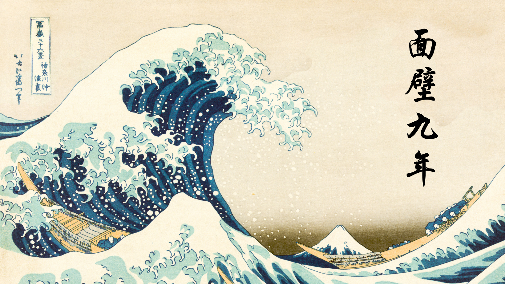

<h1 align="center">🌊 Welcome to inori-dev’s GitHub 🌊</h1>

---

<!--About Me　STA-->
# <picture></picture> About me
<tr border="none">
<td width="50%" align="left">

1. I'm a web frontend and backend developer from Japan.
2. Weekend Coding × Weekday Learning as a Habit

## 🛠️ One I've used 🛠️

### 💻 Programming Languages

### ♾️ Software & Tools

### 💾 Databases

 </a>

### 🌐Devops

### 🎛️ Operating Systems

### 💻 IDEs/Editors

<!-- line-->

<!--Github Stats-->
# Github Stats 

## 🧠 GitHub Overview
### 📊 Stats & Top Languages

<table>
  <tr>
    <td>
      
    </td>
    <td>
      
    </td>
  </tr>
</table>

### 🏆 GitHub Trophy

<!-- footer line-->

